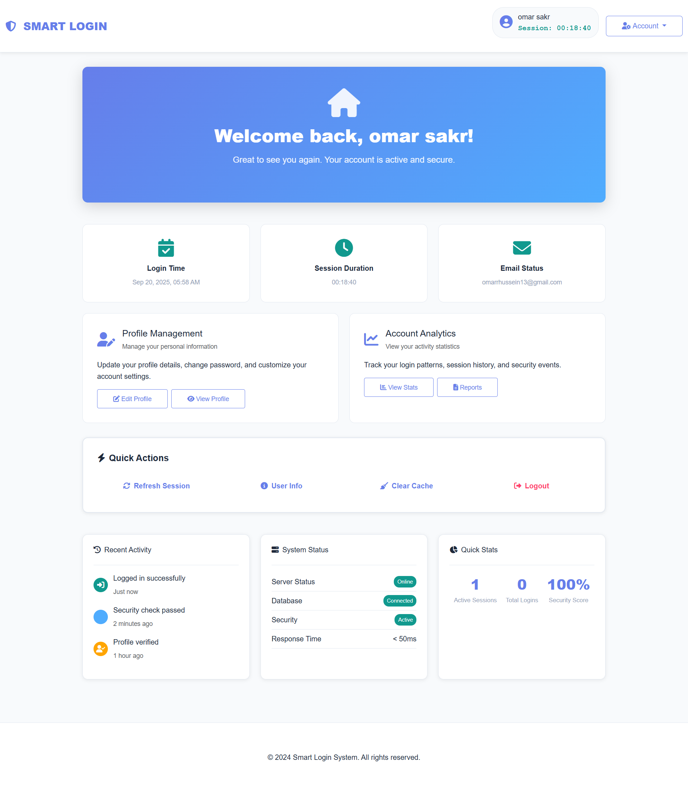
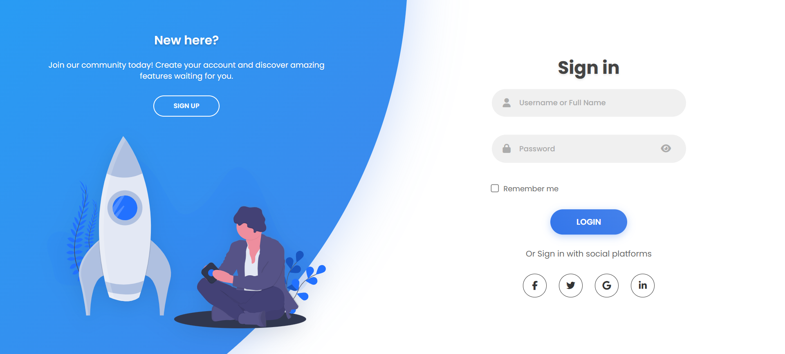
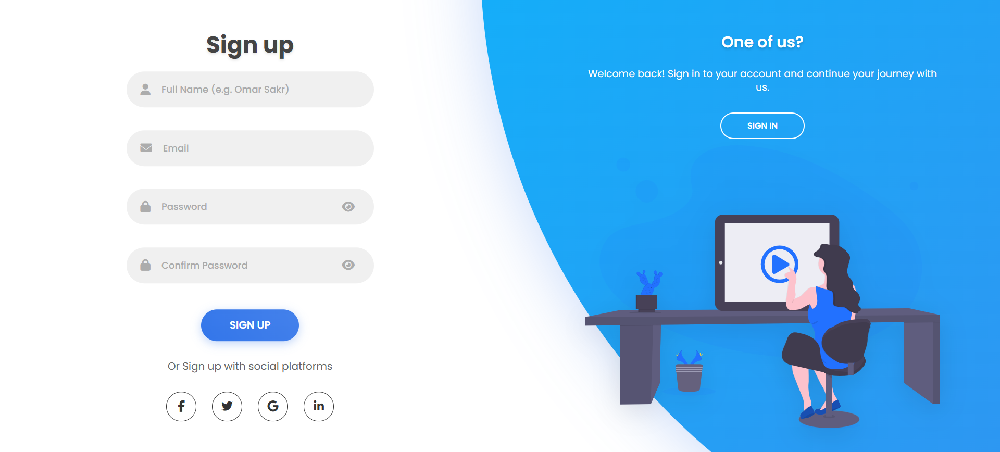

<div align="center">

# 🔐 Login & Register - Your Gateway to Seamless Authentication

<p>
  <table>
    <tr>
      <td></td>
      <td></td>
      <td></td>
    </tr>
    <tr>
      <td></td>
      <td></td>
      <td></td>
    </tr>
    <tr>
      <td></td>
      <td></td>
      <td></td>
    </tr>
  </table>
  <br>
  <b>Login & Register</b>: منصة موثوقة وسهلة الاستخدام لتسجيل الدخول والاشتراك مع دعم شامل للشاشات المختلفة. 🚀
  <br>

[Live Demo](https://omarrsakr.github.io/Login-and-Sign-Up/) •
[Documentation](https://github.com/OmarrSakr/Login-and-Sign-Up/wiki) •
[Report Issues](https://github.com/OmarrSakr/Login-and-Sign-Up/issues)

</p>
<br>

**`Login & Register`** is a responsive authentication platform built with modern web technologies (**`HTML5`**, **`CSS3`**, **`JavaScript`**, **`Bootstrap`**) to provide seamless login and registration experience. Features smooth animations, social media integration, and full responsive design optimized for all screen sizes including tablets and mobile devices.




</div>

<div align="center">

<p align="center">

## 📊 Project Stats

- 🔐 **Authentication Forms**: 2 (Login & Register)
- ⭐ **Average Rating**: 4.8/5 (based on user feedback)
- 🌐 **Visitors**: 

</p>

---

## 🧑‍💻 Tech Stack

<p>
  
  
  
  
  
  
</p>

---

## 📷 Screenshots

<table>
  <tr>
    <td></td>
    <td></td>
  </tr>
</table>
</div>

---

## 📑 Table of Contents

- [🌐 Live Demo](#-live-demo)
- [🚀 Features](#-features)
- [🛠️ Technologies Used](#️-technologies-used)
- [📂 Project Structure](#-project-structure)
- [🔧 Installation](#-installation)
- [⚙️ Usage](#️-usage)
- [🛠️ Challenges & Solutions](#️-challenges--solutions)
- [📌 Future Improvements](#-future-improvements)
- [📢 Known Issues](#-known-issues)
- [🤝 Contributing](#-contributing)
- [📪 Feedback](#-feedback)
- [📜 License](#-license)

---

## 🌐 Live Demo

Check out the live demo of **Login & Register** at 👉 [Login-and-Sign-Up Demo](https://omarrsakr.github.io/Login-and-Sign-Up/)

---

## 🚀 Features

- 🔐 **Secure Login Form**: Username/email and password authentication with validation.
- 📝 **User Registration**: Complete signup form with email verification styling.
- 🌐 **Social Media Integration**: Login options for Facebook, Twitter, Google, and LinkedIn.
- 📱 **Fully Responsive Design**: Optimized for desktop, tablet, and mobile devices.
- ✨ **Smooth Animations**: CSS transitions and JavaScript animations for better UX.
- 🎨 **Modern UI/UX**: Clean design with Poppins font and Font Awesome icons.
- 🔄 **Seamless Navigation**: Switch between login and signup without page reload.
- 💾 **Form Data Persistence**: Remember user inputs using localStorage.
- 🎯 **Input Validation**: Real-time form validation with user-friendly error messages.
- 🖼️ **Interactive Graphics**: SVG illustrations for enhanced visual appeal.

---

## 🛠️ Technologies Used

- **HTML5**: Semantic structure and accessibility features.
- **CSS3**: Advanced styling with Flexbox, Grid, and custom animations.
- **JavaScript (ES6+)**: Form handling, validation, and interactive features.
- **Bootstrap 5**: Responsive grid system and utility classes.
- **Font Awesome**: Professional icons for social media and UI elements.
- **Google Fonts**: Poppins, Roboto, and Inter fonts for modern typography.
- **SVG Graphics**: Scalable vector images for login and register panels.
- **LocalStorage API**: Client-side data persistence.

📦 **Dependencies**

- [Bootstrap](https://cdn.jsdelivr.net/npm/bootstrap@5.3.0/dist/css/bootstrap.min.css)
- [Font Awesome](https://cdnjs.cloudflare.com/ajax/libs/font-awesome/6.4.0/css/all.min.css)
- [Google Fonts](https://fonts.googleapis.com/css2?family=Poppins:wght@300;400;500;600;700&display=swap)

---

## 📂 Project Structure

```
Login-and-Sign-Up/
├── CSS/
│   ├── all.min.css                 # Font Awesome styles
│   ├── bootstrap.min.css           # Bootstrap CSS framework
│   ├── style.css                   # Main stylesheet with custom styles
│   └── media.css                   # Media queries for responsive design
├── images/
│   ├── download.png                # Browser favicon
│   ├── log.svg                     # Login panel illustration
│   └── register.svg                # Registration panel illustration
├── Js/
│   ├── main.js                     # Core JavaScript functionality
│   └── bootstrap.bundle.min.js     # Bootstrap JavaScript bundle
├── index.html                      # Main HTML file
└── README.md                       # Project documentation
```

---

## 🔧 Installation

1- **Clone the repository**

```bash
git clone https://github.com/OmarrSakr/Login-and-Sign-Up.git
```

2- **Navigate to the project directory:**

```bash
cd Login-and-Sign-Up
```

3- Open `index.html` in a modern browser or use a local server (e.g., VS Code Live Server).

---

## 📋 Requirements

- Modern web browser (Chrome 90+, Firefox 88+, Safari 14+, Edge 90+)
- Internet connection for CDN resources
- No additional dependencies or installations required

---

## ⚙️ Usage

- 🔐 **Login**: Enter your username/email and password to access your account.
- 📝 **Register**: Create a new account with username, email, and password.
- 🌐 **Social Login**: Use social media buttons for quick authentication.
- 📱 **Mobile Experience**: Enjoy full functionality on tablets and smartphones.
- 🔄 **Switch Forms**: Toggle between login and registration forms seamlessly.

---

## 🛠️ Challenges & Solutions

- **Responsive Animation Issues**

  - **Challenge**: Animations were not working properly on different screen sizes (tablets and mobile devices).
  - **Solution**: Implemented CSS media queries in `media.css` with device-specific animation durations and transforms. Used `transform3d()` for hardware acceleration and `will-change` property for better performance.

- **Cross-Device Form Validation**

  - **Challenge**: Form validation behaved inconsistently across different devices and screen orientations.
  - **Solution**: Created responsive validation messages using Bootstrap's validation classes and custom CSS. Implemented touch-friendly form controls for mobile devices.

- **Data Persistence Issues**

  - **Challenge**: User form data was lost when switching between login and register forms or on page refresh.
  - **Solution**: Implemented localStorage to save form data temporarily. Added automatic form restoration and smart data cleanup to prevent storage overflow.

- **Mobile Navigation & Touch Interactions**

  - **Challenge**: Social media buttons and form switching weren't optimized for touch devices.
  - **Solution**: Increased touch targets to 44px minimum, added hover states for desktop and focus states for keyboard navigation. Implemented swipe gestures for form switching on mobile.

- **Performance on Low-End Devices**

  - **Challenge**: Animations caused lag on older mobile devices and tablets.
  - **Solution**: Added `prefers-reduced-motion` media query support, optimized CSS animations, and implemented conditional animation loading based on device capabilities.

---

## 📌 Future Improvements

- 🔒 **Two-Factor Authentication (2FA)**: Enhanced security with SMS/email verification codes.
- 📧 **Email Verification**: Complete email verification system with activation links.
- 🔑 **Password Recovery**: Forgot password functionality with secure reset links.
- 🌍 **Multi-Language Support**: Internationalization (i18n) for Arabic and English.
- 🎨 **Theme Customization**: Dark/light mode toggle with user preferences.
- 📊 **Analytics Dashboard**: User login statistics and activity tracking.
- 🔐 **OAuth Integration**: Complete integration with Google, Facebook, and GitHub APIs.
- 📱 **Progressive Web App (PWA)**: Offline functionality and app-like experience.

---

## 📢 Known Issues

- ⚠️ **Tablet Portrait Mode**: Some animations may have slight delays on older tablet devices.
- ⚠️ **iOS Safari**: Form autofill styling may differ slightly from other browsers.
- ⚠️ **Internet Explorer**: Not supported (modern browsers only).

For bug reports and suggestions, please use our [GitHub Issues](https://github.com/OmarrSakr/Login-and-Sign-Up/issues) page.

---

## 🤝 Contributing

We welcome contributions! To contribute:

1- **Fork** the repository  
2- **Create a feature branch**

```bash
git checkout -b feature/your-feature-name  
```

3- **Commit your changes:**

```bash
git add .
git commit -m "Add: description of your feature" 
```

4- **Push to the branch:**

```bash
git push origin feature/your-feature-name    
```

5- **Submit a Pull Request**

Please read our [Contributing Guidelines](CONTRIBUTING.md) and [Code of Conduct](CODE_OF_CONDUCT.md) before contributing.

---

## 📪 Feedback

💡 Have **suggestions** or found **bugs**?  
We'd love to hear from you!

<a href="https://mail.google.com/mail/?view=cm&fs=1&to=DevOmarHussien@gmail.com" target="_blank">
  
</a>

Or create an issue on our [GitHub Issues](https://github.com/OmarrSakr/Login-and-Sign-Up/issues) page.

---

## 📜 License

This project is licensed under the **MIT License**.  
See the [LICENSE](./LICENSE.md) file for details.

---

<div align="center">

**⭐ If you found this project helpful, please give it a star! ⭐**

*Built with ❤️ by Omar Sakr*

[](https://github.com/OmarrSakr)

</div>